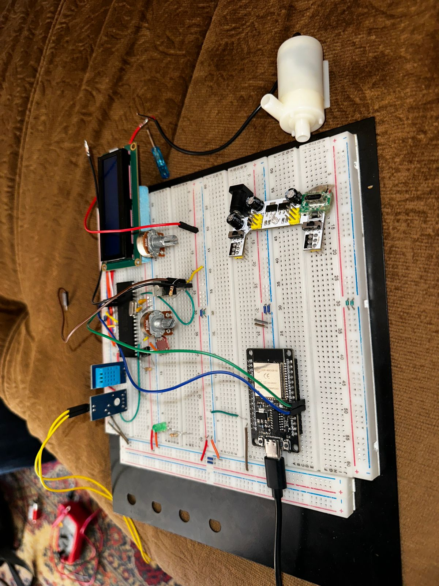
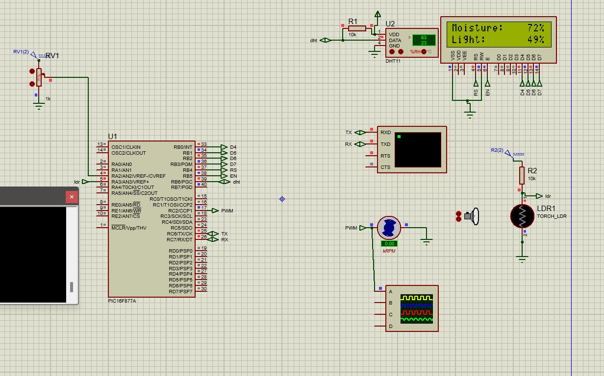

# Automatic Plant Watering System

## Overview
This project is an automatic plant watering system that utilizes an ESP32 microcontroller to run a web server and execute API calls to send commands to a PIC16F877A main microcontroller. The PIC16F877A reads sensor values from a soil moisture meter, a DHT11 temperature and humidity sensor, and an LDR (Light Dependent Resistor) for luminosity measurements. Based on these sensor readings and commands received from the ESP32, the PIC16F877A drives a water pump through a switched PWM signal to water the plants as needed.

## Features
- Web interface for monitoring sensor readings and controlling the watering system
- Automatic plant watering based on soil moisture levels
- Temperature, humidity, and luminosity monitoring
- WiFi configuration through an access point (AP) mode

## Components
- ESP32 microcontroller for running the web server and API
- PIC16F877A microcontroller for reading sensors and controlling the water pump
- Soil moisture sensor
- DHT11 temperature and humidity sensor
- LDR (Light Dependent Resistor) for luminosity measurement
- Water pump

## Usage
1. Power on the device through a USB-C connection.
2. Connect to the device's AP WiFi network to configure it by adding your WiFi network and password to the interface.
3. Access the server IP to view sensor readings, water your plants, and stop watering.

## Images




## Code
### ESP32 Code
```cpp
// #include <SSD1306.h>
#include <ArduinoJson.h>
#include <WiFi.h>
#include <WebServer.h>
#include <WiFiManager.h>
#include "WebPage.h"


//Initialize /////////////////////////////////

//OLED display.
// SSD1306 display(0x3c, 5, 4);

//Web server.
WebServer server(80);

//I/O pins.
int ledPin = 2;
int wifiSettingsResetPin = 14;

//Wifi AP ssid and password.
const char* ssid = "MyEspWebServerSetupAP";
const char* password = "";

///////////////////////////////////////////////


void setup()
{
  //Initialize display.
  // display.init();
  // display.flipScreenVertically();
  // display.setFont(ArialMT_Plain_10);

  //Display initial AP connection info on the OLED screen.
  DisplayAPInfo(ssid, password, "/");

  //Open a serial port.
  Serial.begin(921600);

  Serial1.begin(9600, SERIAL_8N1, 16, 17); //Serial1 is used to communicate with the PIC.

  //Print the AP info to the serial port.
  Serial.println("SSID: ");
  Serial.print(ssid);
  Serial.println("Password: ");
  Serial.print(password);

  //Initialize WiFiManager
  WiFiManager wm;
  if(digitalRead(wifiSettingsResetPin)) //If reset pin is HIGH.
    wm.resetSettings(); //Reset network settings.

  wm.setDebugOutput(false); //Disable debug info by default.

  //Create the initial AP used for setting the wifi configuration.
  bool response = wm.autoConnect(ssid, password);

  if (!response) {
    Serial.println("Failed to connect. Retrying connection ...");

    //Try again in 5s.
    ESP.restart();
    delay(5000);
  } else {
    Serial.println("Connected to wifi with IP: ");
    String ip = WiFi.localIP().toString();
    Serial.println(WiFi.localIP());

    DisplayAPInfo(ssid, password, ip);
  }

  //Set I/O.
  pinMode(ledPin, OUTPUT);

  //Initialize web server.
  initWebServer();
}
String data = "555"; //global
void loop(){
  server.handleClient();

  

if (Serial1.available()) {
    data = Serial1.readStringUntil('\n');
    parseData(data);
  }
  
  // Your code for other tasks
}


  int temperature = 1;
  int moisture = 2;
  int humidity = 3;
  int light = 4;
  void parseData(String data) {
  int tempIndex = data.indexOf("temp:");
  int moistIndex = data.indexOf("moist:");
  int humidIndex = data.indexOf("humid:");
  int lightIndex = data.indexOf("light:");

  if (tempIndex != -1 && moistIndex != -1 && humidIndex != -1 && lightIndex != -1) {
    String tempStr = data.substring(tempIndex + 5, data.indexOf(',', tempIndex));
    String moistStr = data.substring(moistIndex + 6, data.indexOf(',', moistIndex));
    String humidStr = data.substring(humidIndex + 6, data.indexOf(',', humidIndex));
    String lightStr = data.substring(lightIndex + 6, data.indexOf(',', lightIndex));

    temperature = tempStr.toInt();
    moisture = moistStr.toInt();
    moisture = moisture /10;
    humidity = humidStr.toInt();
    light = lightStr.toInt();
    light = light * 10;
    // humidity = humidity /10;
    
    Serial.println("Received Data:");
    Serial.print("Temperature: ");
    Serial.println(temperature);
    Serial.print("Moisture: ");
    Serial.println(moisture);
    Serial.print("Humidity: ");
    Serial.println(humidity);
    Serial.print("Light: ");
    Serial.println(light);
  }
}

inline void DisplayAPInfo(String ssid, String password, String ip) {
//   display.clear();

//   display.setTextAlignment(TEXT_ALIGN_LEFT);
//   display.drawString(0, 0, "SSID: " + ssid);
//   display.drawString(0, 10, "Pass: " + password); 
//   display.drawString(0, 20, "IP: " + ip);

//   display.display(); 

    Serial.println("SSID: " + ssid);
    Serial.println("Pass: " + password);
    Serial.println("IP: " + ip);
    
}


//////////////// Web Server ///////////////////

void initWebServer() {
  //Serve the HTML page to client when they go to the root path.
  server.on("/", HTTP_GET, serveInitialPage);

  //Setup other endpoints.
  server.on("/toggleLED", HTTP_GET, toggleLED);
  server.on("/readSensor", HTTP_POST, readSensor);

  //Start web server.
  server.begin();
}


void serveInitialPage() {
  server.send(200, "text/html", WEBPAGE);
}

void toggleLED() {
  if (server.hasArg("action")) {
    String action = server.arg("action");

    if (action == "water") {
      Serial1.println("1");
      digitalWrite(ledPin, HIGH);
    }

    if (action == "stop") {
      Serial1.println("2");
      digitalWrite(ledPin, LOW);
    }
  }

  server.send(200, "text/plain", ""); //Send web page.
}
void readSensor() {
  // Prepare JSON document
  StaticJsonDocument<200> serJsonDoc;
  serJsonDoc["temperature"] = temperature;
  serJsonDoc["moisture"] = moisture;
  serJsonDoc["humidity"] = humidity;
  serJsonDoc["light"] = light;

  // Serialize JSON to string
  char jsonString[200];
  serializeJson(serJsonDoc, jsonString);

  // Send response
  server.send(200, "application/json", jsonString);
}
```

### PIC16F877A Code
```c
// #include <SSD1306.h>
#include <ArduinoJson.h>
#include <WiFi.h>
#include <WebServer.h>
#include <WiFiManager.h>
#include "WebPage.h"


//Initialize /////////////////////////////////

//OLED display.
// SSD1306 display(0x3c, 5, 4);

//Web server.
WebServer server(80);

//I/O pins.
int ledPin = 2;
int wifiSettingsResetPin = 14;

//Wifi AP ssid and password.
const char* ssid = "MyEspWebServerSetupAP";
const char* password = "";

///////////////////////////////////////////////


void setup()
{
  //Initialize display.
  // display.init();
  // display.flipScreenVertically();
  // display.setFont(ArialMT_Plain_10);

  //Display initial AP connection info on the OLED screen.
  DisplayAPInfo(ssid, password, "/");

  //Open a serial port.
  Serial.begin(921600);

  Serial1.begin(9600, SERIAL_8N1, 16, 17); //Serial1 is used to communicate with the PIC.

  //Print the AP info to the serial port.
  Serial.println("SSID: ");
  Serial.print(ssid);
  Serial.println("Password: ");
  Serial.print(password);

  //Initialize WiFiManager
  WiFiManager wm;
  if(digitalRead(wifiSettingsResetPin)) //If reset pin is HIGH.
    wm.resetSettings(); //Reset network settings.

  wm.setDebugOutput(false); //Disable debug info by default.

  //Create the initial AP used for setting the wifi configuration.
  bool response = wm.autoConnect(ssid, password);

  if (!response) {
    Serial.println("Failed to connect. Retrying connection ...");

    //Try again in 5s.
    ESP.restart();
    delay(5000);
  } else {
    Serial.println("Connected to wifi with IP: ");
    String ip = WiFi.localIP().toString();
    Serial.println(WiFi.localIP());

    DisplayAPInfo(ssid, password, ip);
  }

  //Set I/O.
  pinMode(ledPin, OUTPUT);

  //Initialize web server.
  initWebServer();
}
String data = "555"; //global
void loop(){
  server.handleClient();

  

if (Serial1.available()) {
    data = Serial1.readStringUntil('\n');
    parseData(data);
  }
  
  // Your code for other tasks
}


  int temperature = 1;
  int moisture = 2;
  int humidity = 3;
  int light = 4;
  void parseData(String data) {
  int tempIndex = data.indexOf("temp:");
  int moistIndex = data.indexOf("moist:");
  int humidIndex = data.indexOf("humid:");
  int lightIndex = data.indexOf("light:");

  if (tempIndex != -1 && moistIndex != -1 && humidIndex != -1 && lightIndex != -1) {
    String tempStr = data.substring(tempIndex + 5, data.indexOf(',', tempIndex));
    String moistStr = data.substring(moistIndex + 6, data.indexOf(',', moistIndex));
    String humidStr = data.substring(humidIndex + 6, data.indexOf(',', humidIndex));
    String lightStr = data.substring(lightIndex + 6, data.indexOf(',', lightIndex));

    temperature = tempStr.toInt();
    moisture = moistStr.toInt();
    moisture = moisture /10;
    humidity = humidStr.toInt();
    light = lightStr.toInt();
    light = light * 10;
    // humidity = humidity /10;
    
    Serial.println("Received Data:");
    Serial.print("Temperature: ");
    Serial.println(temperature);
    Serial.print("Moisture: ");
    Serial.println(moisture);
    Serial.print("Humidity: ");
    Serial.println(humidity);
    Serial.print("Light: ");
    Serial.println(light);
  }
}

inline void DisplayAPInfo(String ssid, String password, String ip) {
//   display.clear();

//   display.setTextAlignment(TEXT_ALIGN_LEFT);
//   display.drawString(0, 0, "SSID: " + ssid);
//   display.drawString(0, 10, "Pass: " + password); 
//   display.drawString(0, 20, "IP: " + ip);

//   display.display(); 

    Serial.println("SSID: " + ssid);
    Serial.println("Pass: " + password);
    Serial.println("IP: " + ip);
    
}


//////////////// Web Server ///////////////////

void initWebServer() {
  //Serve the HTML page to client when they go to the root path.
  server.on("/", HTTP_GET, serveInitialPage);

  //Setup other endpoints.
  server.on("/toggleLED", HTTP_GET, toggleLED);
  server.on("/readSensor", HTTP_POST, readSensor);

  //Start web server.
  server.begin();
}


void serveInitialPage() {
  server.send(200, "text/html", WEBPAGE);
}

void toggleLED() {
  if (server.hasArg("action")) {
    String action = server.arg("action");

    if (action == "water") {
      Serial1.println("1");
      digitalWrite(ledPin, HIGH);
    }

    if (action == "stop") {
      Serial1.println("2");
      digitalWrite(ledPin, LOW);
    }
  }

  server.send(200, "text/plain", ""); //Send web page.
}
void readSensor() {
  // Prepare JSON document
  StaticJsonDocument<200> serJsonDoc;
  serJsonDoc["temperature"] = temperature;
  serJsonDoc["moisture"] = moisture;
  serJsonDoc["humidity"] = humidity;
  serJsonDoc["light"] = light;

  // Serialize JSON to string
  char jsonString[200];
  serializeJson(serJsonDoc, jsonString);

  // Send response
  server.send(200, "application/json", jsonString);
}
```

### Web UI Code
```html
<!DOCTYPE html>
<html lang="en">
<head>
    <meta charset="UTF-8">
    <meta name="viewport" content="width=device-width, initial-scale=1.0">
    <title>Plant Monitoring System</title>
    <style>
        body {
            background-color: #4b5563;
            color: white;
            min-height: 100vh;
            display: flex;
            flex-direction: column;
            align-items: center;
            justify-content: center;
            margin: 0;
        }
        h1 {
            font-size: 2.25rem;
            font-weight: bold;
            margin-bottom: 2rem;
        }
        .card {
            background-color: #2d2d2d;
            box-shadow: 0 1px 3px rgba(0, 0, 0, 0.1), 0 1px 2px rgba(0, 0, 0, 0.06);
            border-radius: 0.5rem;
            padding: 1.5rem;
            margin-bottom: 2rem;
        }
        .text-xl {
            font-size: 1.25rem;
            margin-bottom: 0.5rem;
        }
        .font-semibold {
            font-weight: 600;
        }
        .button {
            background-color: #3b82f6;
            color: white;
            padding: 0.5rem 1rem;
            border-radius: 0.5rem;
            border: none;
            cursor: pointer;
            transition: background-color 0.3s;
            margin-right: 1rem;
        }
        .button:hover {
            background-color: #2563eb;
        }
        .button.red {
            background-color: #ef4444;
        }
        .button.red:hover {
            background-color: #dc2626;
        }
        .state-container {
            box-shadow: 0 1px 3px rgba(0, 0, 0, 0.1), 0 1px 2px rgba(0, 0, 0, 0.06);
            border-radius: 0.5rem;
            padding: 1rem;
            background-color: #4caf50; /* Default state color */
        }
    </style>
</head>
<body>
    <h1>Plant Monitoring System</h1>
    <div class="card">
        <p class="text-xl">Temperature: <span class="font-semibold" id="temperature">N/A</span> °C</p>
        <p class="text-xl">Humidity: <span class="font-semibold" id="humidity">N/A</span> %</p>
        <p class="text-xl">Soil Moisture: <span class="font-semibold" id="soilMoisture">N/A</span> %</p>
        <p class="text-xl">Light Amount: <span class="font-semibold" id="lightAmount">N/A</span> lx?</p>
    </div>
    <div style="display: flex; gap: 1rem; margin-bottom: 1rem;">
        <button onclick="sendCommand('water')" class="button">Water</button>
        <button onclick="sendCommand('stop')" class="button red">Stop</button>
    </div>
    <div id="currentStateContainer" class="state-container">
        <p class="text-xl">Current State: <span class="font-semibold" id="currentState">N/A</span></p>
    </div>

    <div style="margin-top: 2rem;">
        <button onclick="getSensorReadings()" class="button">Update Sensor Readings</button>
    </div>

    <script>
        async function sendCommand(command) {
            try {
                const response = await fetch(`/toggleLED?action=${command}`);
                if (!response.ok)
                    throw new Error('Error sending command');
            } catch (error) {
                console.error('Error: ', error);
            }
        }

        async function getSensorReadings() {
            try {
                const data = await fetchReading();
                updateSensorData(data);
            } catch (error) {
                console.error('Error fetching sensor readings:', error);
            }
        }

        async function fetchReading() {
            try {
                const response = await fetch("/readSensor", {
                    method: 'POST',
                    headers: {
                        'Content-Type': 'application/json'
                    }
                });

                if (!response.ok)
                    throw new Error('Error fetching readings');

                const data = await response.json();
                return data;
            } catch (error) {
                console.error('Error: ', error);
            }
        }

        function updateSensorData(data) {
            if (data) {
                document.getElementById('temperature').innerText = data.temperature;
                document.getElementById('humidity').innerText = data.humidity;
                document.getElementById('soilMoisture').innerText = data.moisture;
                document.getElementById('lightAmount').innerText = data.light;

                const currentState = getCurrentState(data);
                document.getElementById('currentState').innerText = currentState;
                updateStateContainer(currentState);
            } else {
                console.error('No data received to update sensor values.');
            }
        }

        function getCurrentState(data) {
            if (data.temperature > 30) {
                return 'Warning';
            } else if (data.moisture < 20) {
                return 'Critical';
            } else {
                return 'Normal';
            }
        }

        function getStateColor(state) {
            switch (state) {
                case 'Normal': return '#4caf50';
                case 'Warning': return '#ff9800';
                case 'Critical': return '#f44336';
                default: return '#4caf50';
            }
        }

        function updateStateContainer(state) {
            document.getElementById('currentStateContainer').style.backgroundColor = getStateColor(state);
        }
    </script>
</body>
</html>
```

## Contributors
- Omar Ahmed Elsayed
- Marwan Hazem
- Khaled kamal
- Filopateer foad
